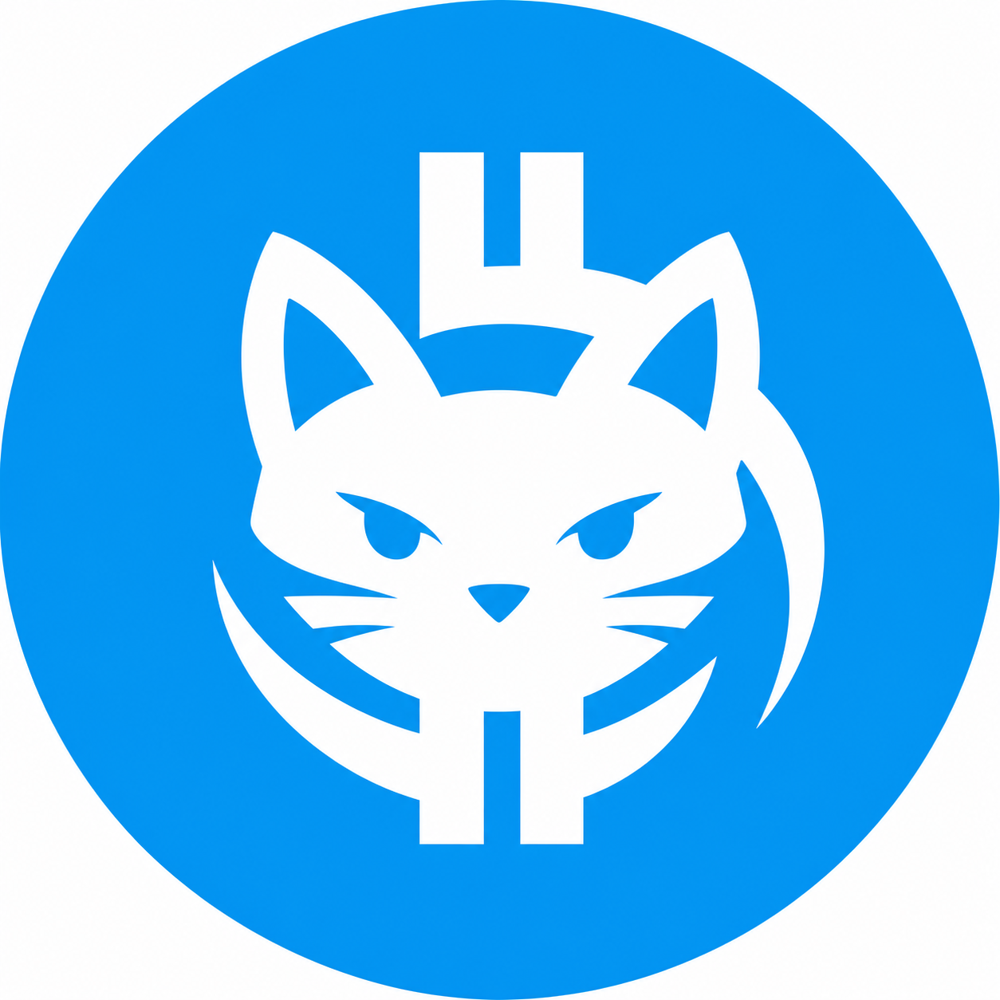

# TG BTC Cat

TG BTC Cat is a production-target community DAO jetton project on TON built with Acton/Tolk around the tgBTC narrative.

Holders are intended to govern protocol parameters on-chain, including buy/sell fees, wallet-specific fee rules, and community event campaigns.

## Status

This repository is the source of truth for the full product:

- Acton `1.0.0` project setup for TON smart contract development.
- Token avatar asset and jetton metadata draft.
- Production contract architecture and wallet roles.
- Production Tolk contracts for jetton master/wallet, irreversible governor, fee controller, wallet fee registry, DEX registry, DAO treasury, and event controller.
- Generated Tolk and TypeScript wrappers.
- Acton deployment script for local emulation and testnet/mainnet execution.
- Contract tests, bounce/security coverage, and critical mutation checks.
- Web app work remains a separate implementation track.

The target is not an MVP. The target is a full launchable product with production contracts, a public web interface, TON Connect transaction flows, visible vote history, treasury tracking, testnet deployment, verification, and security review.

## Product Scope

The final product includes:

- `tgBTCat` jetton master and custom jetton wallet.
- Irreversible treasury-to-vote governance.
- Global buy/sell fee governance from `0%` to `100%`.
- Wallet-specific buy/sell fee governance from `0%` to `100%`.
- DEX registry for buy/sell classification.
- Vote treasury and fee treasury.
- Public web app with TON Connect.
- On-chain proposal creation and execution.
- Vote explorer: voter, side, amount, transaction hash, timestamp, proposal totals.
- Minimalist brand interface matching TG BTC Cat identity.

## Metadata

Draft jetton metadata lives in [`metadata/jetton.json`](metadata/jetton.json).

Current asset:



## Development

```bash
source "$HOME/.acton/bin/env"
acton doctor
acton build
acton test
acton check
acton fmt --check
```

Regenerate wrappers after ABI changes:

```bash
acton wrapper --all
acton wrapper --all --ts
```

## Storage Plan

GitHub is used for public source control and asset backup. For token metadata and image URLs, prefer permanent or content-addressed storage:

- Primary: Arweave permanent upload.
- Secondary: IPFS CID pinned by multiple pinning providers.
- Backup: GitHub release/source asset.
