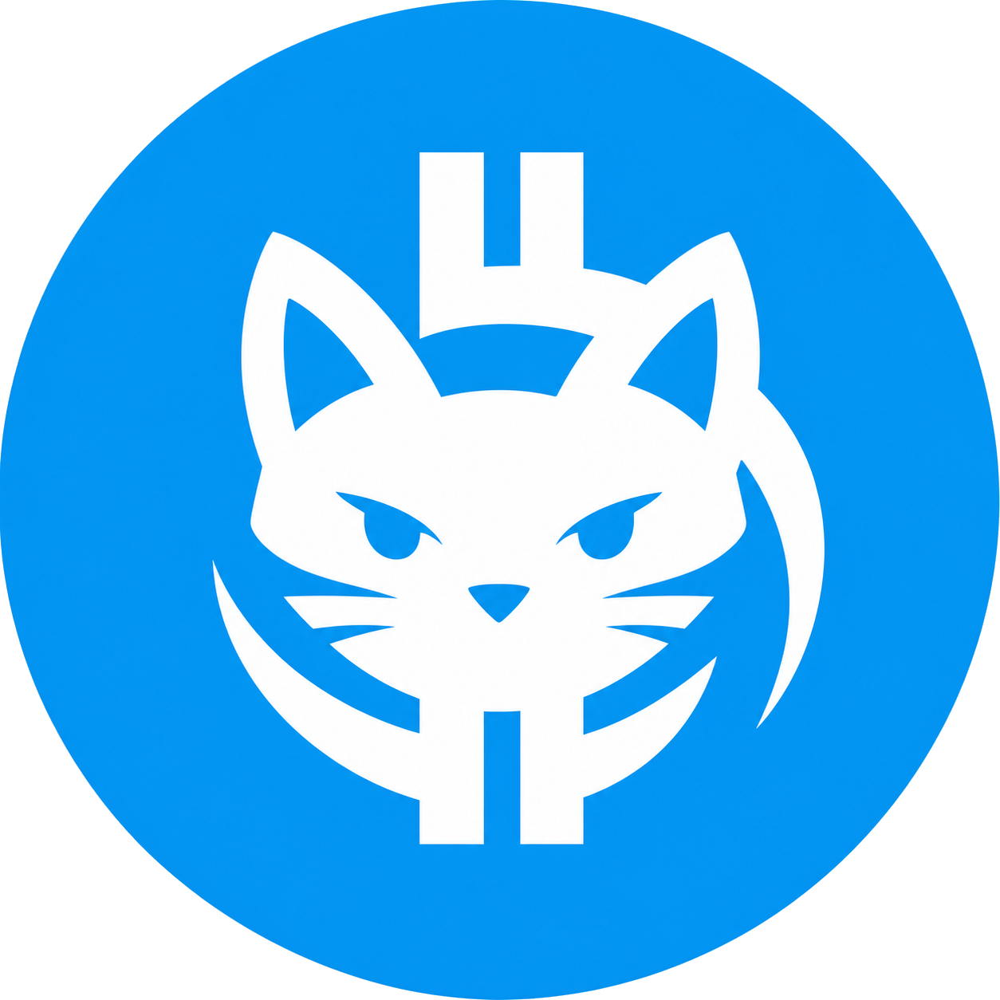

<p align="center">
  
</p>

<h1 align="center">TG BTC Cat</h1>

<p align="center">
  A governance-first TON jetton protocol for the tgBTC narrative.
</p>

<p align="center">
  
  
  
  
</p>

## Protocol

TG BTC Cat is a DAO-governed jetton system built on TON with Acton and Tolk. The core idea is simple: holders can commit `tgBTCat` on-chain to shape protocol behavior, fee policy, treasury movement, wallet-specific rules, and community events.

Voting is intentionally irreversible. A vote is cast by sending `tgBTCat` to governance; the amount sent becomes vote weight and remains in the governance treasury. This creates a direct cost for influence and makes governance activity visible on-chain.

## What It Controls

- Global buy and sell fees from `0%` to `100%`.
- Wallet-specific buy and sell fee rules from `0%` to `100%`.
- DEX wallet classification for transfer-side fee logic.
- DAO treasury TON and jetton operations.
- Community event creation, updates, scheduling, and status changes.
- Jetton wallet runtime propagation through governed execution.

## Contract Stack

| Contract | Role |
| --- | --- |
| `TgBtcCatJettonMaster` | Jetton master, metadata, mint/admin flow, wallet discovery |
| `TgBtcCatJettonWallet` | Custom fee-aware jetton wallet with bounce restoration |
| `TgBtcCatGovernor` | Irreversible token voting, proposal execution, raw governed calls |
| `TgBtcCatFeeController` | Global buy/sell fee state |
| `TgBtcCatWalletFeeRegistry` | Wallet-specific fee governance |
| `TgBtcCatDexRegistry` | DEX wallet classification |
| `TgBtcCatTreasury` | DAO-controlled TON and jetton treasury operations |
| `TgBtcCatEventController` | On-chain community event registry |

## Current Build

- Production Tolk contracts for the current protocol surface.
- Generated Tolk and TypeScript wrappers.
- Acton deployment script for local emulation, testnet, and mainnet execution.
- Contract tests for governance, fees, wallet runtime, bounce handling, gas edges, protocol validation, treasury, and events.
- Critical mutation checks for the active governance and controller paths.
- TON Connect governance console with vote payloads, fee proposal builder, transaction previews, and contract registry.

Latest local gate:

```bash
acton wrapper --all
acton wrapper --all --ts
acton build
acton test        # 99 passed
acton check
acton fmt --check
acton script scripts/deploy.tolk
```

## Testnet Deployment

The current testnet deployment is live and wired into the web console.

| Contract | Address |
| --- | --- |
| Governor | `kQA1GaTDOvM36bPDcBl8j1t1XAwzxTaAuNqrr0K2fRYMm5Vc` |
| Jetton Master | `kQBmTqJHA8NBgpBu4tNXHwcOSEQKSTiPsDKZoZ0HVOR0xZlo` |
| Vote Jetton Wallet | `kQA1i5KmymwMKEx2ET_XSQlkYFCKSKB03-mVbrZABWSyJaQ7` |
| Fee Controller | `kQAe6eyIysCucV94ZOE4n62Cn8_NRqRT0FwnmITXxi4_g1vu` |
| Wallet Fee Registry | `kQANR_V5_bi1zKutTcCRSakJ8lcNaRLULy6beEGDIffYVilw` |
| DEX Registry | `kQBY1IAJoAihGBN3zhPqSt8QzaY6GZKjB5xrnMV5-I8VlzRt` |
| DAO Treasury | `kQD4NsPFs18yjR_eqyhIItwr-xNQ4h4gR45-X2ZsaiK3HRMa` |
| Event Controller | `kQAsrtKveDh-cgmqf1EYSjy_knLxKqI8GUZZwwKXGfDtNKxI` |
| Fee Treasury | `kQC2sHx4TKwlHSxCwH-CsZ0DFUzV9zZMdJIaWNTEvc1BLdp7` |

## Governance Model

1. A proposal is created on-chain.
2. A holder sends `tgBTCat` to the governor with an encoded vote payload.
3. The received token amount becomes vote weight.
4. Votes are counted as `FOR`, `AGAINST`, or `ABSTAIN`.
5. Passed proposals execute governed actions through typed controller routes or whitelisted raw execution.
6. Failed outbound execution can bounce and restore proposal execution state.

## Repository Layout

```text
contracts/      Tolk smart contracts and shared message/storage schemas
wrappers/       Generated Tolk wrappers
wrappers-ts/    Generated TypeScript wrappers for app integration
tests/          Acton contract tests
scripts/        Deployment and configuration scripts
metadata/       Jetton metadata draft
assets/         Brand assets
docs/           Product, persistence, and wallet notes
web/            TON Connect governance console
```

## Development

```bash
source "$HOME/.acton/bin/env"
acton doctor
acton build
acton test
acton check
acton fmt --check
```

Regenerate wrappers after ABI or message changes:

```bash
acton wrapper --all
acton wrapper --all --ts
```

Run deployment emulation:

```bash
acton script scripts/deploy.tolk
```

Broadcast only after testnet validation:

```bash
acton script scripts/deploy.tolk --net testnet
```

Run the web console:

```bash
cd web
npm install
npm run dev
```

Production web checks:

```bash
cd web
npm run build
npm run lint
```

## Product Direction

The target is a launch-ready TON DAO product: audited contracts, verified deployments, a public TON Connect interface, proposal and vote explorer, treasury visibility, permanent metadata, and a clean brand surface around the tgBTC narrative.
